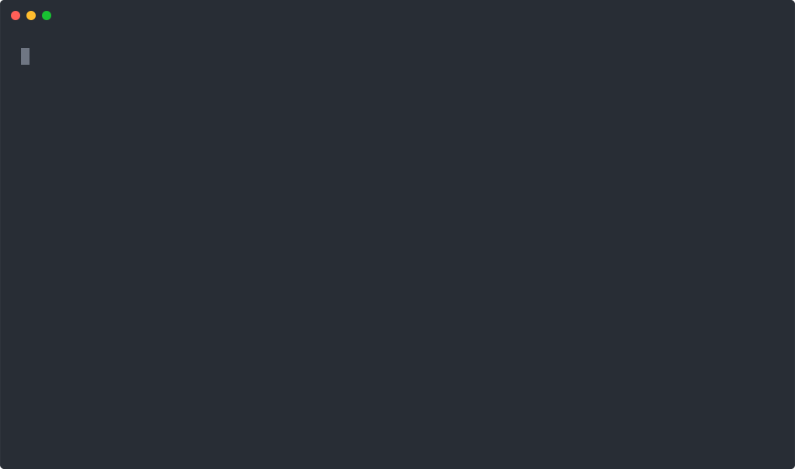

# artgraph

[](https://github.com/ShintaroMorimoto/artgraph/actions/workflows/ci.yml)
[](https://www.npmjs.com/package/artgraph)
[](https://www.npmjs.com/package/artgraph)
[](LICENSE)
[](package.json)

Deterministic spec-to-code context for AI coding agents — one graph linking requirements, docs, code, and tests.

artgraph builds a graph that links requirement IDs in your specs to the code that
implements them (`@impl` tags) and the tests that verify them (`[ID]` / `req:` tags),
then detects **drift** (spec changed but code/tests didn't), **orphans**, and
**uncovered** requirements. The same graph powers `artgraph impact`, so an agent
gets only the specs, docs, and tests a change touches — not your entire `CLAUDE.md`.

## Why artgraph

Your repo probably already has a code-graph MCP. It knows your code. It doesn't know your spec.

Code-graph MCPs — codegraph, GitNexus, Sourcegraph MCP, and dozens more — give AI
coding agents a symbol-level map of your codebase. Useful, but the map stops at the
code. When an agent rewrites `signIn`, nothing tells it that `REQ-001` in
`specs/auth.md` said "email and password", that `docs/auth.md` is now stale, or
that a test still asserts the old contract.

artgraph adds the layer *above* the code:

- **One typed graph over requirements, docs, code, and tests** — not four
  disconnected artifact stores. Every edge is deterministic and sourced from
  AST-visible tags (`@impl`, `[REQ-ID]`, `req:`), markdown links, YAML
  frontmatter, SDD-tool file conventions, or TypeScript imports. No LLM in
  the graph, no embedding retrieval, no RAG.
- **Zero-tag warm start on brownfield repos** — `artgraph impact --diff`
  returns a change's blast radius from the TypeScript import graph alone,
  before you write a single `@impl` tag or a `.artgraph.json`. Tags,
  requirement IDs, and `.trace.lock` progressively raise precision as
  your team adopts them, but they are never the entry fee to first-day
  value.
- **Per-change context routing** — `artgraph impact --diff` returns only the
  specs, docs, and tests a given change touches. Feed *that* to the agent
  instead of the whole context file.
- **Drift as a CI gate** — `artgraph check --gate` fails the build when a spec
  changed but the code/tests didn't, when code claims to implement a
  nonexistent requirement, or when a requirement has zero verifying tests.
  Byte-identical output on every run.
- **Requirement IDs are the primary key** — the same `REQ-001` string is what
  the spec lists, what the agent puts in `@impl`, and what the test brackets.
  That single key is what makes the 4-layer graph joinable at all — and what
  lets `artgraph rename` refactor a requirement everywhere in one pass.

Code-graph MCPs answer *"where is this used?"*. artgraph answers *"which
requirement does this satisfy, and does it still?"*.

## 30-second tag-zero start

Have an existing TypeScript repo? Get impact analysis in three commands — **no
specs, no `@impl` tags, no config required**:

<!-- Regenerate with: pnpm demo (build + demo:record + demo:svg) — see scripts/record-tag-zero-demo.mjs -->
<p align="center">
  
</p>

```bash
pnpm dlx artgraph init             # brownfield-safe; no specs required
# ... edit a file ...
pnpm dlx artgraph impact --diff    # → files affected via your TS import graph
```

That's the entire onboarding. `impact --diff` walks the deterministic
TypeScript import graph, so it works from day one on any TS repo. Specs,
`@impl` tags, and drift detection are opt-in — add them progressively as
your project demands more traceability.

Ready for the full workflow (specs → tags → drift detection → CI gates)?
Continue with **Quickstart** below.

## Quickstart

> **Pre-release**: artgraph is not yet on npm. Until `v0.1.0` ships, install from the GitHub repo
> (e.g. `npm install -D ShintaroMorimoto/artgraph` / `pnpm add -D github:ShintaroMorimoto/artgraph` /
> `bun add -d github:ShintaroMorimoto/artgraph`). The plain `artgraph` registry name in the commands
> below will start resolving once the first release is published.

```bash
# Pick your package manager (npm / pnpm / Bun / Deno all supported; Yarn falls back to pnpm)
npm install -D artgraph && npx artgraph init --agents=claude       # pick your agent(s)
# pnpm add -D artgraph && pnpm exec artgraph init --agents=claude,codex
# bun add -d artgraph && bunx artgraph init --agents=claude
# deno add npm:artgraph && deno run -A npm:artgraph/cli init --agents=claude
```

`artgraph init` runs the full setup: `.artgraph.json` config + initial scan + cross-agent Skills distribution + auto-integrate detected SDD tools (Spec Kit / Kiro) + Stop hook + AGENTS.md snippet (and a thin `CLAUDE.md` / `.github/copilot-instructions.md` wrapper when the matching agent is selected). The `--agents=<list>` flag is **required** whenever Skills or agent-context distribution runs — supported values are `claude`, `codex`, `cursor`, `copilot`, `kiro` (lowercase, comma-separated). To opt out instead, pass `--minimal` for bare config only, or `--no-skills --no-agent-context` to skip both distribution stages (`--agents` is then optional).

### Tier 1 cross-agent distribution

`--agents=<list>` distributes the same canonical SKILL.md set (8 Skills + 3 `_shared/` fragments) to each agent's native discovery path. AGENTS.md is the single canonical agent-context body; the per-agent wrapper files only contain a `@AGENTS.md` import line so the body never duplicates.

| `--agents` value | Agent | Skills path | Agent context | Wrapper file |
| --- | --- | --- | --- | --- |
| `claude`   | Claude Code | `.claude/skills/`  | `AGENTS.md` | `CLAUDE.md` |
| `codex`    | Codex CLI (OpenAI) | `.agents/skills/`  | `AGENTS.md` | — (AGENTS.md native) |
| `cursor`   | Cursor | `.cursor/skills/`  | `AGENTS.md` | — (AGENTS.md native) |
| `copilot`  | GitHub Copilot (IDE / CLI / Coding Agent) | `.github/skills/`  | `AGENTS.md` | `.github/copilot-instructions.md` |
| `kiro`     | Kiro | `.kiro/skills/`    | `AGENTS.md` | — (`.kiro/steering/artgraph.md` is handled separately by `--integrations=kiro`) |

If you use Claude Code, you can skip the manual install entirely — type `/artgraph-setup` and the Skill detects the package manager, installs artgraph, and runs `init` for you in one turn.

### Windows note

On Windows, artgraph distributes a `.gitattributes` file into each `<agent-skills-path>/` that forces LF for the tracked files. Do NOT set `core.autocrlf=true` globally — if `.gitattributes` is not committed, `artgraph doctor` may report drift after checkout. Alternatively add `.claude/skills/** text eol=lf` (and equivalents for other agents) to your repo's `.gitattributes`.

Selecting `--agents=copilot` creates `.github/skills/` in your repo. If your project uses CODEOWNERS / branch protection for `.github/`, coordinate with your team before running `artgraph init --agents=copilot`.

### Committing distributed Skills

Distributed Skills under `.claude/skills/`, `.agents/skills/`, `.cursor/skills/`, `.github/skills/`, and `.kiro/skills/` are safe to commit — they're deterministic byte-identical outputs of `artgraph init --agents=<list>`. Team members without artgraph installed still get the Skills via `git pull`. If you prefer to keep them out of git (e.g. to avoid bumping the diff on every artgraph upgrade), add the paths to `.gitignore`; teammates then need to run `artgraph init --agents=<list>` locally.

### End-to-end: spec → `@impl` → `check`

> The examples below call `artgraph` directly — substitute your package runner if
> the binary isn't on your `PATH`: `npx artgraph` (npm) / `pnpm exec artgraph` /
> `bunx artgraph` / `deno run -A npm:artgraph/cli`.

```bash
# 1. Write a requirement
mkdir -p specs && cat > specs/auth.md <<'EOF'
- REQ-001: Users can sign in with email and password.
EOF

# 2. Tag the implementation
cat > src/auth.ts <<'EOF'
// @impl REQ-001
export function signIn(email: string, password: string) { /* … */ }
EOF

# 3. Tag the test
cat > tests/auth.test.ts <<'EOF'
import { describe, it } from "vitest";
describe("auth", () => {
  it("[REQ-001] accepts non-empty credentials", () => { /* … */ });
});
EOF

# 4. Snapshot the baseline, then change the spec to see drift surface
artgraph reconcile
sed -i 's/email and password\./email, password, and TOTP./' specs/auth.md
artgraph check
```

```
DRIFT:
  REQ-001 (req)
  doc:auth.md (doc)
COVERAGE:
  REQ-001: verified
```

Add `--gate` (`artgraph check --gate`) to a CI step or pre-commit hook to
exit non-zero whenever drift, orphans, or uncovered requirements are present.

A runnable copy of this flow lives in [`examples/basic/`](./examples/basic).

### Using an SDD tool?

artgraph wires into Spec Kit and Kiro via [`artgraph integrate`](#sdd-tool-integration),
so drift detection runs at the right workflow checkpoint instead of relying on
a manual `check` call. Each example below installs the integration, walks the
full workflow, and shows the exact diff against `extensions.yml` / steering:

- **Spec Kit** — [`examples/speckit-integration/`](./examples/speckit-integration):
  `after_tasks` / `after_implement` hooks and the opt-in `before_implement` gate.
- **Kiro** — [`examples/kiro-integration/`](./examples/kiro-integration):
  steering file that teaches the Kiro agent when to call `impact` / `check --diff` / `reconcile`.

Repository: <https://github.com/ShintaroMorimoto/artgraph>. To work on artgraph itself, see [CONTRIBUTING.md](./CONTRIBUTING.md).

## How references are expressed

| Artifact            | Reference form                                  |
| ------------------- | ----------------------------------------------- |
| Spec list item      | `- REQ-001: description`                        |
| Spec heading (Kiro) | `### Requirement 1: description`                |
| Implementation      | `// @impl REQ-001`                              |
| Test                | `it("[REQ-001] …")` or `// req: "REQ-001"`      |
| Doc relations       | frontmatter `artgraph.depends_on` / `derives_from`, inferred from kiro / spec-kit file-name conventions, or inline `[text](./other.md)` links |

Custom grammars are configurable via `reqPatterns` in `.artgraph.json`.

## Doc graph (`docGraph` config)

Doc nodes (one per markdown file under `specDirs`) and their relations can be
generated four ways. All are enabled by default and can be turned off
individually via the `docGraph` block in `.artgraph.json`:

| Key                | Default | What it does                                                                                                                                                            |
| ------------------ | ------- | ----------------------------------------------------------------------------------------------------------------------------------------------------------------------- |
| `autoNodes`        | `true`  | Register every `*.md` under `specDirs` as a `doc` node, even without frontmatter.                                                                                       |
| `autoContains`     | `true`  | Emit `contains` edges from each doc node to req nodes defined in the same file.                                                                                         |
| `autoConventions`  | `true`  | Emit `derives_from` edges by matching kiro / spec-kit file-name conventions within the same directory (see table below). Frontmatter-declared edges are deduped against these. |
| `inlineLinks`      | `true`  | Emit `depends_on` edges from inline markdown links between spec/doc files (see "Inline links" below). Frontmatter-declared edges on the same `(source, target)` pair always win. |

### Conventions inferred by `autoConventions`

| Convention | Files (same dir)                                | Edges generated (`derives_from`)                 |
| ---------- | ----------------------------------------------- | ------------------------------------------------ |
| kiro       | `requirements.md`, `design.md`, `tasks.md`      | `design → requirements`, `tasks → design`        |
| spec-kit   | `spec.md`, `plan.md`, `tasks.md`, `research.md` | `plan → spec`, `tasks → plan`, `research → spec` |

Notes:

- An edge is emitted only when _both_ endpoints exist in the same directory, so
  partial sets never produce `orphan-doc` warnings.
- Matching is case-insensitive (`Design.md` works).
- A directory containing both kiro and spec-kit files (e.g. `design.md` and
  `plan.md` together) gets `tasks` linked to _both_ `design` and `plan` —
  intentional for the mixed case, but downstream `dependsOn` will show both
  chains.
- **Cycles**: convention edges alone form a DAG, but combining them with a
  user-declared frontmatter edge pointing the opposite way (e.g. `requirements`
  declaring `derives_from: [design]`) can produce a silent cycle. artgraph does
  not run cycle detection — keep frontmatter edges aligned with the convention
  direction.

### Inline links extracted by `inlineLinks`

Inline markdown links between spec/doc files are picked up automatically and
emitted as `depends_on` edges (e.g. `design.md` with `See [requirements](./requirements.md)`
generates `doc:design.md --depends_on--> doc:requirements.md`). Direct, reference-style
(`[x][ref]` + `[ref]: ./...`), and shortcut forms are all supported; anchors and
queries are stripped; links inside code fences and inline code are ignored. A
frontmatter relation (`derives_from` / `depends_on`) on the same `(source, target)`
pair always wins over an inline link.

To opt out of any of the above:

```jsonc
// .artgraph.json
{
  "docGraph": {
    "autoConventions": false,        // default true — disable file-name convention inference
    "inlineLinks": true,             // default true — set false to disable inline-link extraction
    "linkWarnings": {
      "unresolved": true,            // default true — warn on links to missing .md
      "outOfScope": false            // default false — warn on .md outside specDirs
    }
  }
}
```

> **Behavior change on upgrade.** `inlineLinks` and `linkWarnings.unresolved`
> default to `true`, so an upgrade in place can both add `depends_on` edges to
> the graph and emit new `WARNING: unresolved-link` lines on stderr for inline
> links pointing at non-existent `.md` files. If you gate CI on stderr or on
> graph stability, opt out with `"docGraph": { "inlineLinks": false }` (and/or
> `"linkWarnings": { "unresolved": false }`) and migrate at your pace.


## Task graph (`taskConventions` config)

artgraph extracts **task nodes** from Spec Kit / Kiro `plan.md` and `tasks.md`
files, then converts each SDD tool's cross-link tags into edges. **Tag syntax
is preset-supplied** — every SDD tool can define its own ID format and tag
regexes; there is no global `@impl` / `[REQ-]` convention baked into the parser.

### Built-in presets

| Preset       | files (stem)        | task ID                          | `implements` tag        | `verifies` tag                                  |
| ------------ | ------------------- | -------------------------------- | ----------------------- | ----------------------------------------------- |
| **spec-kit** | `plan`, `tasks`     | `T\d+` (e.g. `T001`)             | `@impl(target-id)`      | `[REQ-FR-001]` / `[FR-001]` / `[Requirement-3]` |
| **kiro**     | `tasks`             | `\d+(\.\d+)*` (e.g. `1`, `1.1`)  | *(not used by Kiro)*    | `- _Requirements: 1.1, 2.3, 3.1_` (italic list) |

Notes:
- `doc → contains → task` edges are emitted under `docGraph.autoContains` (the
  same flag that drives `doc → req`).
- Kiro's `tasks.md` requires the `[ ]`/`[x]` checkbox on each task line — bare
  numbered lists like `- 1 release shipped` are not treated as tasks.
- For nested Kiro tasks (`- [x] 1.1 ...` indented under `- [x] 1. ...`), each
  level's `_Requirements:` lists attach to its own task only; parents do not
  inherit child requirements.

### Adding a custom SDD tool (OpenSpec, etc.)

Append a preset to `taskConventions` — built-ins remain active. Each preset
chooses its own tag syntax via optional `implementsTagRe` / `verifiesTagRe`
(capture group 1 = target ID, applied with `/g` semantics):

```jsonc
// .artgraph.json
{
  "taskConventions": [
    {
      "name": "openspec",
      "fileStems": ["tasks"],
      "taskIdRe": "^(?:\\[[xX ]\\]\\s+)?(OS-\\d+)\\b",
      "implementsTagRe": "@impl\\(([^)\\n]+)\\)",
      "verifiesTagRe": "→\\s*(REQ-[\\w-]+)"
    }
  ]
}
```

All three regex fields are validated the same way `reqPatterns` is
(≤ 200 chars, nested-quantifier rejection, capture-group required, valid regex).
Omit `implementsTagRe` or `verifiesTagRe` if your tool doesn't have that edge
kind (Kiro omits `implementsTagRe`).

### Upgrade note

Built-in presets activate automatically on upgrade. Existing projects whose
`tasks.md` already contains `T###` (Spec Kit) or checkbox-prefixed numerics
(Kiro) will see new `task` nodes — and `doc → task` `contains` edges, plus
`task → verifies → ...` edges for Kiro `_Requirements:` lists — on the next
`artgraph scan`. Run `artgraph reconcile` to refresh the lock baseline.


## Edge provenance

Every edge in the graph carries a `provenances: EdgeProvenance[]` array
explaining where it came from. The eight values cover all generation sites:

| Value         | Source                                              |
| ------------- | --------------------------------------------------- |
| `annotation`  | inline `(depends_on: …)` / `(derives_from: …)` notes |
| `frontmatter` | YAML `artgraph.depends_on` / `derives_from`         |
| `convention`  | folder/file-stem conventions (kiro / spec-kit presets) |
| `code-tag`    | `// @impl` / `// @verifies` / `req:` in TS code     |
| `task-tag`    | task preset `_Requirements:` / `[REQ-…]` brackets   |
| `inline-link` | markdown inline `[text](path)` links between docs   |
| `ts-import`   | `import` statements                                 |
| `structural`  | doc → req / task auto-`contains` within the same file |

When the same `(source, target, kind)` is produced by multiple paths, the
arrays are union-merged and sorted (e.g. `["convention", "frontmatter"]`). The
`.trace.lock` mirrors this by storing each `dependsOn` element as
`{id, provenances}`. See [specs/011-edge-provenance/](specs/011-edge-provenance/)
for the formalisation.

> **Note on lock `dependsOn` consumers.** The structured `dependsOn` field in
> `.trace.lock` is currently not consumed by runtime code paths: `artgraph
> check` decides drift purely from `contentHash`, and `coverage` / `impact` /
> `traverse` walk `graph.edges` directly. Its present value is (a) a
> presentational diff target when reviewers read `git diff .trace.lock`, and
> (b) the input that `artgraph rename` rewrites when an ID changes. A
> first-class consumer (e.g. an `artgraph diff` subcommand surfacing
> dependency churn) is **future work** — the `diff` CLI does not exist yet.

## Commands

| Command                  | Purpose                                                                                             |
| ------------------------ | --------------------------------------------------------------------------------------------------- |
| `artgraph scan`          | Build the artifact graph and report counts                                                          |
| `artgraph check`         | Report drift / orphans / uncovered (`--gate` to fail a hook)                                        |
| `artgraph coverage`      | Per-requirement coverage status                                                                     |
| `artgraph impact`        | File-only forward impact (file paths / `--from-tasks` / `--from-plan` / `--diff`)                   |
| `artgraph plan-coverage` | Detect implicit REQ impacts: REQs touched by tasks.md `Files:` but not mentioned in tasks/plan/spec |
| `artgraph reconcile`     | Rebuild `.trace.lock` from the current graph                                                        |
| `artgraph graph`         | Emit the graph (dot / json)                                                                         |
| `artgraph rename`        | Rename / split / merge requirement IDs (see below)                                                  |
| `artgraph doctor`        | Diagnose Tier 1 cross-agent distributions (drift / missing / extraneous-file); see below           |

## `artgraph doctor` — cross-agent distribution health check

Diagnoses whether the SKILL.md files distributed by `artgraph init --agents=<list>`
are still byte-equal to the canonical `templates/skills/` source, whether the
`AGENTS.md` marker block is intact, and whether the per-agent wrapper files
(`CLAUDE.md`, `.github/copilot-instructions.md`) still import `@AGENTS.md`.

```bash
# Diagnose every detected agent distribution (text output, default)
artgraph doctor

# Restrict to specific agents
artgraph doctor --agents=claude,codex

# Machine-readable output
artgraph doctor --format json
```

Exit code is `0` when every finding is `pass` (or no Tier 1 distribution exists
yet), non-zero when at least one finding is `fail` (drift / missing / wrapper
missing the import / extraneous file). Example text output:

```text
[claude] .claude/skills/      12 pass
[codex]  .agents/skills/      12 pass
AGENTS.md: ✓ marker block intact

Summary: 24 pass, 0 fail
```

## `artgraph rename` — ID lifecycle

Renames, splits or merges a requirement ID and rewrites **every** reference to it
(spec list items / headings, `@impl` tags, test tags, frontmatter
`depends_on` / `derives_from`, and `.trace.lock` keys) in one pass, limited to
git-tracked files.

```bash
# Rename one ID
artgraph rename --from REQ-001 --to REQ-100

# Split one ID into several (code @impl tags are flagged for manual re-assignment)
artgraph rename --split REQ-001 --into REQ-101 REQ-102

# Merge several IDs into one
artgraph rename --merge REQ-001 REQ-002 --into REQ-100

# Preview without writing
artgraph rename --from REQ-001 --to REQ-100 --dry-run

# Machine-readable output (errors are emitted as JSON too)
artgraph rename --from REQ-001 --to REQ-100 --format json
```

Notes:

- **Always commit first** — rename writes to tracked files in place. Use `--dry-run`
  to preview.
- **Target IDs are validated**: they must match the requirement-ID grammar
  (`REQ-001`, `auth/FR-2`, `Requirement-3`) or the `doc:` prefix, so the renamed ID
  is guaranteed to be re-discoverable by the next scan.
- After a non-preview run the lock is automatically reconciled, so `artgraph check`
  passes immediately for `rename` and `merge`.
- **split** intentionally does **not** re-assign `@impl` tags (the mapping is
  ambiguous); the new IDs are reported as `uncovered` until you assign them and fill
  in their scaffolded spec lines. `check` will flag this until done.
- IDs inside fenced code blocks are treated as examples and left untouched.

## SDD tool integration

`artgraph integrate` wires the scan / reconcile / check loop into the SDD tool you
already use, so spec ↔ code drift is caught at the right workflow checkpoint
instead of relying on a manual call.

| Command                           | Purpose                                                                                                                                                             |
| --------------------------------- | ------------------------------------------------------------------------------------------------------------------------------------------------------------------- |
| `artgraph integrate speckit`      | Generate `.specify/extensions/artgraph/` and register Spec Kit hooks (`after_tasks` / `after_implement`, optional `before_implement` via `--gate`)                 |
| `artgraph integrate kiro`         | Write `.kiro/steering/artgraph.md` so the Kiro agent learns when to call `impact / check --diff / reconcile`                                                       |
| `artgraph integrate list`         | Show every supported integration with detect / installed status                                                                                                     |
| `artgraph init --integrations=<ids>` | One-shot: run `init` _and_ integrate the named tools (`speckit`, `kiro`, `all`); pass `--integrate-gate` to add Spec Kit's `before_implement` hook in the same call. The value-form flag was renamed from `--integrate=<ids>` to `--integrations=<ids>` so that `--integrate` / `--no-integrate` could be used as a boolean opt-out for the default auto-integrate stage. |

Since `init` now auto-integrates every detected SDD tool by default, the `--integrations=<csv>` form is only needed when you want to override that selection (for example, install Spec Kit hooks only in a repo that also has `.kiro/`).

```bash
# Inside a repo that already has .specify/
artgraph integrate speckit              # idempotent
artgraph integrate speckit --gate       # also add before_implement gate
artgraph integrate speckit --no-gate    # remove only artgraph's before_implement hook
artgraph integrate speckit --uninstall  # remove the extension dir + every artgraph hook entry

# Kiro
artgraph integrate kiro                 # writes .kiro/steering/artgraph.md
artgraph integrate kiro --force         # overwrite a hand-edited steering file

# Discover what's available
artgraph integrate list                 # detected / installed flags per tool

# Bootstrap + integrate in one shot
artgraph init --integrations=all --integrate-gate
```

Notes:

- All write paths are **atomic** and roll back the entire `install` call if any
  file fails to write, so a partial Spec Kit / Kiro layout never lands on disk.
- Re-running an `integrate` command is always safe: the second invocation
  reports `Already integrated: ... — no changes` and leaves the disk byte-for-byte
  identical.
- `--gate` is _declarative_: `--gate` sets the hook to present, `--no-gate`
  removes it, and omitting the flag leaves the current state untouched. Other
  extensions' hooks in `extensions.yml` are never touched.
- The full design lives in
  [specs/009-sdd-integration/spec.md](./specs/009-sdd-integration/spec.md);
  the end-to-end walkthrough (every scenario the E2E tests cover) is in
  [specs/009-sdd-integration/quickstart.md](./specs/009-sdd-integration/quickstart.md).

## Claude Code skills

artgraph ships 8 Claude Code Skills that wire the CLI into the agent workflow:

| Skill                       | Input mode    | When it fires                                                                                                                              |
| --------------------------- | ------------- | ------------------------------------------------------------------------------------------------------------------------------------------ |
| `artgraph-setup`            | n/a           | User wants to install / set up / add artgraph on a fresh project                                                                           |
| `artgraph-integrate`        | n/a           | User wants to wire artgraph into an installed SDD tool (Spec Kit / Kiro)                                                                   |
| `artgraph-detect`           | n/a           | User asks whether artgraph is set up / what's installed / what's available                                                                 |
| `artgraph-impact`           | file + symbol | Forward impact analysis. Input is file paths or `path:symbol` pairs (REQ-IDs are rejected) — explicit args, `--from-tasks <path>`, `--from-plan <path>`, or `--diff` |
| `artgraph-plan-coverage`    | file + symbol | Detects implicit impacts: files / `path:symbol` declared in `tasks.md` may affect existing REQs not mentioned in `tasks.md` / `plan.md` / `spec.md`. Run after `/speckit-tasks` or before `/speckit-implement` |
| `artgraph-verify`           | n/a           | User reports implementation completion or wants a consistency check                                                                        |
| `artgraph-coverage`         | n/a           | User asks for progress, remaining work, or what's left to test                                                                             |
| `artgraph-rename`           | n/a           | User wants to rename / split / merge requirement IDs                                                                                       |

Skills marked `file + symbol` accept either `src/auth.ts` (file unit) or `src/auth.ts:validateToken` (symbol unit). Symbol-level input additionally requires `.artgraph.json` to be set to `"mode": "symbol"` and the graph re-scanned — see [docs/skills-guide.md](docs/skills-guide.md#file-mode-vs-symbol-mode) for the trade-off, config example, and the `impactReqs` / `originReqs` dual-axis drift guide.

Skills live at `templates/skills/<name>/SKILL.md` and ship in English (for cross-agent reach + Claude Skills best practice). `artgraph init --agents=<list>` distributes them to each selected agent's canonical Skills path (see [Tier 1 cross-agent distribution](#tier-1-cross-agent-distribution) above); pass `--no-skills` to opt out of the distribution stage.

> Note: `artgraph-impact` was previously called `artgraph-plan`. It was renamed because "plan" implies pre-change design while the underlying `artgraph impact --diff` only works once changes exist. Spec 014 then narrowed the CLI surface to **file-only** start sources (REQ-ID inputs now error out with a four-path migration hint), and split the "implicit impact" use case into the dedicated `artgraph-plan-coverage` Skill so each Skill's description matches what the CLI actually delivers.

For implementation details and customization tips, see [docs/skills-guide.md](docs/skills-guide.md).
