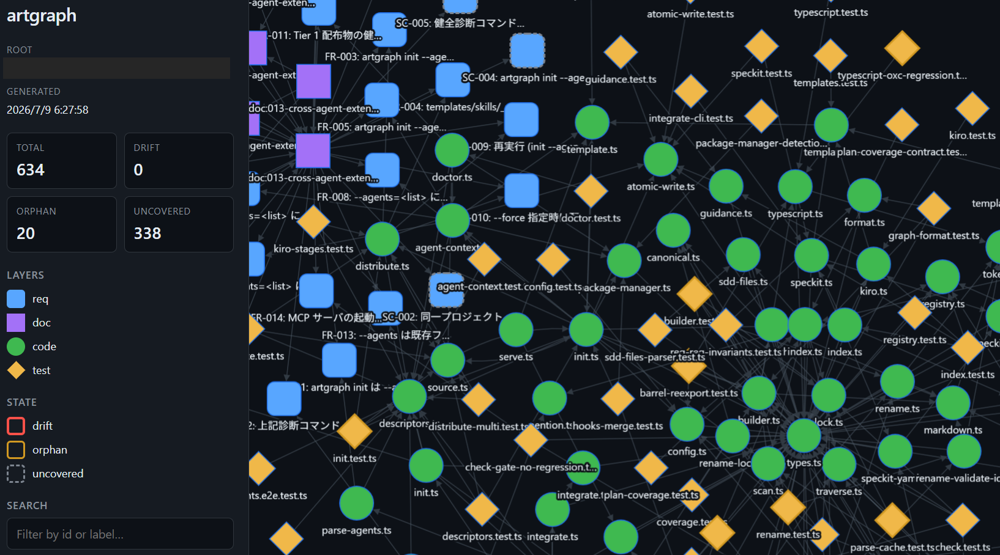

# artgraph

**English** | [日本語](./README.ja.md)

[](https://github.com/mori-shin-x/artgraph/actions/workflows/ci.yml)
[](https://www.npmjs.com/package/artgraph)
[](https://www.npmjs.com/package/artgraph)
[](LICENSE)
[](package.json)

**Deterministic spec-to-code context for AI coding agents — one graph linking requirements, docs, code, and tests.**

artgraph builds a graph that links requirement IDs in your specs to the code
that implements them (`@impl` tags) and the tests that verify them, then
detects **drift** (spec changed but code/tests didn't), **orphans**, and
**uncovered** requirements. Skills fire during agent conversations, a Stop
hook fires when the agent finishes a turn, and SDD-tool hooks fire at Spec Kit
/ Kiro workflow checkpoints — so drift is caught by the agent, not by a
human running `check` after the fact.

## 30-second tag-zero start

Have an existing TypeScript repo? Get impact analysis in three commands — **no
specs, no `@impl` tags, no config required**:

<!-- Regenerate with: pnpm demo (build + demo:record + demo:svg) — see scripts/record-tag-zero-demo.mjs -->
<p align="center">
  
</p>

```bash
pnpm dlx artgraph init             # brownfield-safe; no specs required
# ... edit a file ...
pnpm dlx artgraph impact --diff    # → files affected via your TS import graph
```

`impact --diff` walks the deterministic TypeScript import graph, so it works
from day one on any TS repo. Specs, `@impl` tags, and drift detection are
opt-in — add them progressively as your project demands more traceability.

## Bootstrapping an existing project

Already have code but no REQs? Ask an agent that speaks artgraph:

```
you> Please bootstrap traceability for src/auth.
```

The `artgraph-bootstrap` Skill proposes `specs/auth.md` with fresh
`REQ-NNN` entries, adds `@impl REQ-NNN` tags to the code that implements each
one, marks the covering tests with `[REQ-NNN]`, and verifies the result with
`artgraph scan && artgraph check` — all as a single reviewable diff. You
review, tweak, and commit.

## Why artgraph

Your repo probably already has a code-graph MCP. It knows your code. It doesn't know your spec.

Code-graph MCPs — codegraph, GitNexus, Sourcegraph MCP, and dozens more — give
AI coding agents a symbol-level map of your codebase. Useful, but the map
stops at the code. When an agent rewrites `signIn`, nothing tells it that
`REQ-001` in `specs/auth.md` said "email and password", that `docs/auth.md` is
now stale, or that a test still asserts the old contract.

artgraph adds the layer *above* the code:

- **One typed graph over requirements, docs, code, and tests** — every edge
  is deterministic and sourced from AST-visible tags (`@impl`, `[REQ-ID]`,
  `req:`), markdown links, YAML frontmatter, SDD-tool conventions, or
  TypeScript imports. No LLM in the graph, no embedding retrieval, no RAG.
- **Per-change context routing** — `artgraph impact --diff` returns only the
  specs, docs, and tests a given change touches. Feed *that* to the agent
  instead of the whole context file.
- **Drift as a CI gate** — `artgraph check --gate` fails the build when a
  spec changed but the code/tests didn't. Byte-identical output on every run.
- **Requirement IDs are the primary key** — the same `REQ-001` string is what
  the spec lists, what the agent puts in `@impl`, and what the test brackets.
  That single key is what makes the 4-layer graph joinable at all.

Code-graph MCPs answer *"where is this used?"*. artgraph answers *"which
requirement does this satisfy, and does it still?"*.

## Quickstart

> **Platforms:** macOS and Linux — including **WSL2** on Windows. Native
> Windows (PowerShell / cmd) is not supported; see the
> [Windows note](#windows-note).

```bash
# Pick your package manager (npm / pnpm / Bun / Deno all supported; Yarn falls back to pnpm)
npm install -D artgraph && npx artgraph init --agents=claude       # pick your agent(s)
# pnpm add -D artgraph && pnpm exec artgraph init --agents=claude,codex
# bun add -d artgraph && bunx artgraph init --agents=claude
# deno add npm:artgraph && deno run -A npm:artgraph/cli init --agents=claude
```

`artgraph init` runs the full setup: `.artgraph.json` config + initial scan + cross-agent Skills distribution + auto-integrate detected SDD tools + Stop hook + `AGENTS.md` snippet. Pass `--minimal` for bare config only, or any of `--no-skills` / `--no-agent-context` / `--no-integrate` / `--no-hooks` to skip specific stages. See [docs/commands.md#artgraph-init](./docs/commands.md#artgraph-init) for the full flag list.

**If you use Claude Code:** skip the manual install entirely — type
`/artgraph-setup` and the Skill detects your package manager, installs
artgraph, and runs `init` for you in one turn.

### Tier 1 cross-agent distribution

`--agents=<list>` distributes the same canonical SKILL.md set (6 Skills +
3 `_shared/` fragments) to each agent's native discovery path. `AGENTS.md` is
the canonical agent-context body; per-agent wrappers only contain a
`@AGENTS.md` import line.

| `--agents` value | Agent | Skills path | Wrapper file |
| --- | --- | --- | --- |
| `claude`   | Claude Code | `.claude/skills/`  | `CLAUDE.md` |
| `codex`    | Codex CLI (OpenAI) | `.agents/skills/`  | — (AGENTS.md native) |
| `cursor`   | Cursor | `.cursor/skills/`  | — (AGENTS.md native) |
| `copilot`  | GitHub Copilot | `.github/skills/`  | `.github/copilot-instructions.md` |
| `kiro`     | Kiro | `.kiro/skills/`    | — (`.kiro/steering/artgraph.md` via `artgraph integrate kiro`) |

> The 5 agents above are the entire supported set — artgraph has no roadmap
> to expand beyond Tier 1 in v0.x. See
> [docs/architecture.md §8 Support Scope](./docs/architecture.md#8-support-scope).

### Windows note

Native Windows (PowerShell / cmd) is not supported. Run artgraph inside
**WSL2** — all supported package managers and Tier 1 agents work there. Git
Bash is untested. See
[docs/getting-started.md#windows](./docs/getting-started.md#windows) for the
CRLF / `.gitattributes` details when teammates check the repo out on native
Windows.

## How the agent loop works

Once installed, artgraph plugs into the agent's runtime at three points, and
you rarely type `artgraph check` yourself:

1. **In-flight (Skills)** — while the agent is editing, `artgraph-impact` and
   `artgraph-plan-coverage` fire on the agent's initiative to surface which
   REQs a proposed change touches, *before* the change lands.
2. **On turn completion (Stop hook)** — when Claude Code hits `Stop`, the
   `.claude/settings.json` hook runs `artgraph check --diff` and blocks the
   turn if drift is detected. Similar hook shapes exist for other Tier 1
   agents where the runtime supports it.
3. **At SDD checkpoints** — with Spec Kit or Kiro installed,
   `artgraph integrate` wires `after_tasks` / `after_implement` (and opt-in
   `before_implement --gate`) into the SDD workflow, so `tasks.md` /
   `plan.md` changes are checked at the right moment instead of a batch pass
   later.

Every hook reduces to `artgraph check` on the same graph, and `--diff`
compares against `.trace.lock`. No LLM in the loop.

## End-to-end: spec → `@impl` → `check`

```bash
# 1. Write a requirement
mkdir -p specs && cat > specs/auth.md <<'EOF'
- REQ-001: Users can sign in with email and password.
EOF

# 2. Tag the implementation
cat > src/auth.ts <<'EOF'
// @impl REQ-001
export function signIn(email: string, password: string) { /* … */ }
EOF

# 3. Tag the test
cat > tests/auth.test.ts <<'EOF'
import { describe, it } from "vitest";
describe("auth", () => {
  it("[REQ-001] accepts non-empty credentials", () => { /* … */ });
});
EOF

# 4. Snapshot the baseline, then change the spec to see drift surface
artgraph reconcile
sed -i 's/email and password\./email, password, and TOTP./' specs/auth.md
artgraph check
```

```
DRIFT:
  REQ-001 (req)
  doc:auth.md (doc)
COVERAGE:
  REQ-001: verified
```

A runnable copy of this flow lives in
[`examples/basic/`](./examples/basic).

## See the graph

`artgraph scan --serve` opens the req / doc / code / test graph as an
interactive Cytoscape.js page in your browser. Node border color and style
encode `drift` / `orphan` / `uncovered`, so you can spot problem areas at a
glance without reading `check` output line by line.

<p align="center">
  
</p>

```bash
artgraph scan --serve                            # http://127.0.0.1:3737/
artgraph scan --serve --port 4000 --host 0.0.0.0 # override port / bind address
artgraph scan --output ./graph-out               # static HTML export
```

With a `.trace.lock` present, drift / orphan / uncovered nodes are colored;
without one, the raw graph structure is rendered. See
[docs/commands.md](./docs/commands.md#artgraph-scan) for the full reference.

## A turn with Spec Kit + artgraph

Here is what a `/speckit-tasks` turn looks like once installed, with the
`artgraph-plan-coverage` Skill wired in:

```
you> /speckit-tasks

<Spec Kit generates tasks.md with T001, T002 pointing at REQ-003, REQ-004>
<Stop → hook runs artgraph check --diff → clean>
<artgraph-plan-coverage fires because tasks.md changed>

agent> tasks.md lists Files: src/auth.ts, but that file also implements
       REQ-001 and REQ-002 — neither is referenced from tasks.md / plan.md /
       spec.md. Do you want me to (a) add tasks for REQ-001/002, (b) exclude
       them from src/auth.ts's scope, or (c) accept and move on?
```

*Which* REQs weren't mentioned and *why* they were reachable comes from
`artgraph plan-coverage` on the changed files. No LLM reasoning about the
graph itself — just the CLI's deterministic output.

## Skills

artgraph ships 6 Skills that wire the CLI into the agent workflow. All are
distributed to every agent selected via `--agents=<list>`.

| Skill                    | Input mode    | When it fires                                                                                                     |
| ------------------------ | ------------- | ----------------------------------------------------------------------------------------------------------------- |
| `artgraph-setup`         | n/a           | User wants to install / set up artgraph, or wire in an SDD tool added after artgraph                              |
| `artgraph-bootstrap`     | n/a           | User wants to bootstrap / cold-start / seed initial REQs on an existing untagged (or partially-tagged) project    |
| `artgraph-impact`        | file + symbol | Agent proposes a change; needs to know which REQs / docs / tests it touches (file paths or `path:symbol` pairs)   |
| `artgraph-plan-coverage` | file + symbol | `tasks.md` / `plan.md` changed; reverse-audit for REQs reached by `Files:` but not mentioned                      |
| `artgraph-verify`        | n/a           | Implementation complete; run `artgraph check --diff` to self-verify before code review                            |
| `artgraph-rename`        | n/a           | User wants to rename / split / merge requirement IDs                                                              |

Skills marked `file + symbol` accept either `src/auth.ts` (file unit) or
`src/auth.ts:validateToken` (symbol unit). Symbol-level input additionally
requires `.artgraph.json` to be set to `"mode": "symbol"` and the graph
re-scanned — see
[docs/skills-guide.md#file-mode-vs-symbol-mode](./docs/skills-guide.md#file-mode-vs-symbol-mode)
for the trade-off and the `impactReqs` / `originReqs` dual-axis drift guide.

## SDD tool integration

`artgraph integrate` wires the scan / reconcile / check loop into the SDD
tool you already use. Built-in targets are Spec Kit
(`.specify/extensions/artgraph/` with `after_tasks` / `after_implement` +
optional `before_implement --gate`) and Kiro (`.kiro/steering/artgraph.md`).

```bash
artgraph integrate speckit          # idempotent; hooks into .specify/
artgraph integrate speckit --gate   # add the before_implement gate
artgraph integrate kiro             # writes .kiro/steering/artgraph.md
artgraph integrate list             # detected / installed per tool
```

`artgraph init` auto-integrates every detected SDD tool by default (Spec Kit
gets the `before_implement` gate hook; pass `--no-integrate` to skip). Worked
examples: [`examples/speckit-integration/`](./examples/speckit-integration)
and [`examples/kiro-integration/`](./examples/kiro-integration). Full detail
in [docs/sdd-integration.md](./docs/sdd-integration.md).

## How references are expressed

| Artifact            | Reference form                                  |
| ------------------- | ----------------------------------------------- |
| Spec list item      | `- REQ-001: description`                        |
| Spec heading (Kiro) | `### Requirement 1: description`                |
| Implementation      | `// @impl REQ-001`                              |
| Test                | `it("[REQ-001] …")` or `// req: "REQ-001"`      |
| Doc relations       | frontmatter `artgraph.depends_on` / `derives_from`, inferred from kiro / spec-kit file-name conventions, or inline `[text](./other.md)` links |

ID prefixes are free-form (`[A-Z][A-Za-z]*-\d+`): the `REQ-` prefix used in
the examples above is just a convention — `FR-001`, `AUTH-2`, or `US-12` work
with zero configuration. If you use Spec Kit, keep its default `FR-NNN` IDs
as-is. To exclude an ID family from tracking (e.g. Spec Kit's `SC-NNN` Success
Criteria, which are outcomes rather than implementable requirements), list its
prefix in `.artgraph.json` `ignoreIdPrefixes` — see
[docs/configuration.md](./docs/configuration.md#ignoreidprefixes--exclude-specific-id-prefixes-from-tracking).

Custom grammars are configurable via `reqPatterns` in `.artgraph.json` — see
[docs/configuration.md](./docs/configuration.md).

## Commands

| Command                  | Purpose                                                                                       |
| ------------------------ | --------------------------------------------------------------------------------------------- |
| `artgraph init`          | Full agent-native setup: config + scan + Skills + SDD integrate + Stop hook + agent context   |
| `artgraph scan`          | Build the graph and report counts (`--serve` / `--output` render as interactive HTML)         |
| `artgraph check`         | Report drift / orphans / uncovered (`--gate` to fail a hook)                                  |
| `artgraph impact`        | File-only forward impact (file paths / `--diff`)                                              |
| `artgraph plan-coverage` | Detect implicit REQ impacts from `tasks.md` `Files:`                                          |
| `artgraph reconcile`     | Rebuild `.trace.lock` from the current graph                                                  |
| `artgraph rename`        | Rename / split / merge requirement IDs                                                        |
| `artgraph integrate`     | Wire artgraph into an installed SDD tool (Spec Kit / Kiro)                                    |
| `artgraph doctor`        | Diagnose Tier 1 cross-agent distributions                                                     |

See [docs/commands.md](./docs/commands.md) for the detailed reference on every
flag, including `scan --serve`, `doctor` finding taxonomy, and the `rename`
split/merge caveats.

## Documentation

- [Getting Started](./docs/getting-started.md) — Windows CRLF, committing Skills, Stop hook troubleshooting
- [Configuration](./docs/configuration.md) — `reqPatterns`, `ignoreIdPrefixes`, `docGraph`, `taskConventions`, edge provenance
- [Commands](./docs/commands.md) — full CLI reference
- [SDD Tool Integration](./docs/sdd-integration.md) — Spec Kit / Kiro details
- [Skills Guide](./docs/skills-guide.md) — file vs symbol mode, Skill customization
- [Architecture](./docs/architecture.md) — design decisions and positioning

Repository: <https://github.com/mori-shin-x/artgraph>. To work on artgraph
itself, see [CONTRIBUTING.md](./CONTRIBUTING.md). For release history, see
[CHANGELOG.md](./CHANGELOG.md).

## Requirements

- Node.js ≥ 22
- macOS or Linux (WSL2 on Windows)
- One or more Tier 1 agents: Claude Code, Codex CLI, Cursor, GitHub Copilot, or Kiro

## License

MIT
